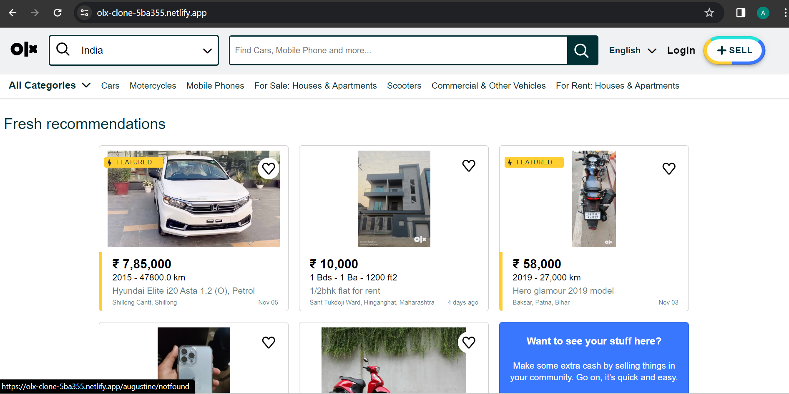
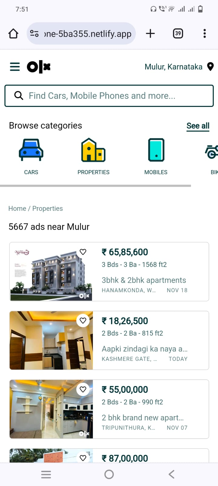

# OLX Clone Project

This project is a simplified clone of OLX, an online marketplace for buying and selling goods. It is developed as a web application to demonstrate a basic e-commerce platform.

## Table of Contents

- [Features](#features)
- [Demo](#demo)
- [Technologies Used](#technologies-used)
- [Setup Instructions](#setup-instructions)
- [Usage](#usage)
- [Contributing](#contributing)
- [License](#license)

## Features

- User authentication (sign up, login, logout)
- Product listing and browsing
- Seller can post products for sale
- Buyer can contact the seller
- Search functionality
- Responsive design for mobile and desktop

## Demo

[Live Demo](#) - Add a link to your live demo if available.





## Technologies Used

- Frontend: HTML, CSS, JavaScript, Jquery

## Setup Instructions

1. Clone the repository:

   ```bash
   git clone https://github.com/your-username/olx-clone-car-section.git
