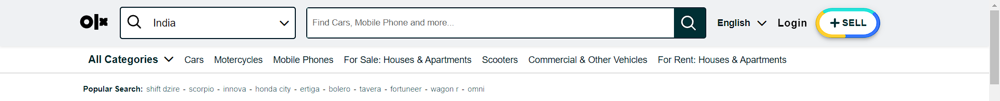
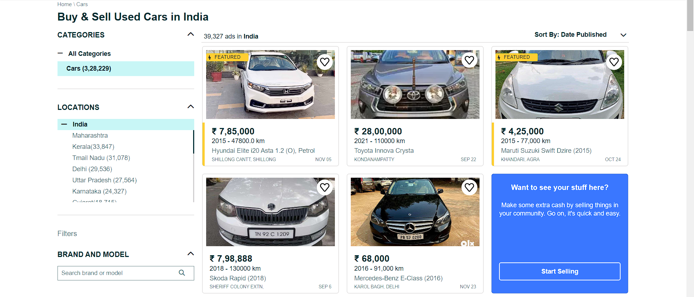
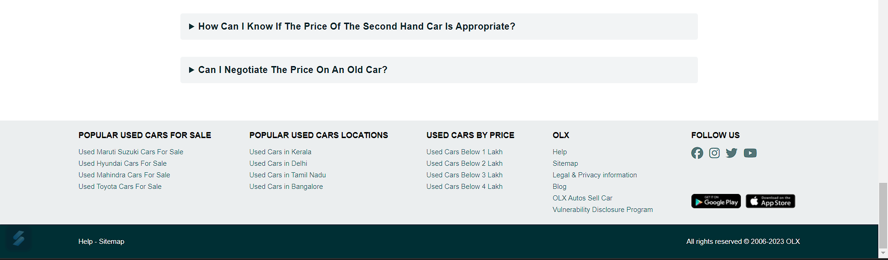

# OLX Clone Project - Car Section


#### Hosted link <a href="https://olx-clone-5ba355.netlify.app/bharat/cars">Cars</a>

## Project Overview

Welcome to our OLX Clone Project – Car Section! In this project, our dedicated team has worked collaboratively to replicate the user interface of the OLX application, specifically focusing on the car section. We have successfully recreated the entire UI, ensuring a seamless and visually appealing experience for users interested in buying or selling cars.

## Technologies Used

- **HTML:** Markup language for structuring the content of our web pages.
- **CSS:** Stylesheets to control the presentation and layout of our web pages.
- **JavaScript:** Scripting language for interactive features and dynamic content.

## Features Implemented

### 1. Fully Functional Aside Bar
   - We have implemented a fully functional aside bar that enhances the user navigation experience. The aside bar provides quick access to essential features, making it easier for users to explore car listings, apply filters, and access additional functionalities.

### 2. Responsive Design with Media Queries
   - Our UI is designed to be responsive, adapting gracefully to various screen sizes and devices. Media queries have been strategically incorporated to ensure a consistent and optimal layout, whether users are accessing the application on desktops, tablets, or smartphones.

### 3. Layout Design Matching the Original
   - The layout of our car section closely mirrors the original OLX application. We have paid meticulous attention to detail, replicating the structure, color scheme, and overall aesthetic to create a UI that feels familiar and intuitive to users.

### 4. Hover Effects for Enhanced User Interaction
   - To elevate the user experience, we have added subtle hover effects to interactive elements. These effects provide visual feedback to users, enhancing the overall interactivity and making the UI more engaging.

## Showcase

### Navigation Bar


### Main Section


### Footer


## Getting Started

### Prerequisites
To explore and contribute to the project, ensure that you have the following tools installed:

- A modern web browser
- Code editor for development (e.g., Visual Studio Code, Sublime Text)

### Clone the Repository
1. Clone the project repository to your local machine:
   ```bash
   git clone https://github.com/your-username/olx-clone-car-section.git

## Explore and Contribute

Feel free to explore the codebase, experiment with new features, or contribute improvements. Our collaborative effort is crucial to refining and expanding the functionalities of the OLX Clone Project – Car Section.

## Contribution Guidelines

1. **Fork the repository.**

2. **Create a new branch for your feature or bug fix:**

    ```bash
    git checkout -b feature/your-feature-name
    ```
3. **Make your changes and commit them:**

    ```bash
    git commit -m "Add your commit message here"
    ```

4. **Push your changes to your forked repository:**

    ```bash
    git push origin feature/your-feature-name
    ```

5. **Open a pull request to the main repository.**

## Acknowledgments

We appreciate the collaborative effort of each team member in bringing this OLX Clone Project – Car Section to life. Thank you for your dedication and commitment to creating a top-notch user interface!

Happy coding!

